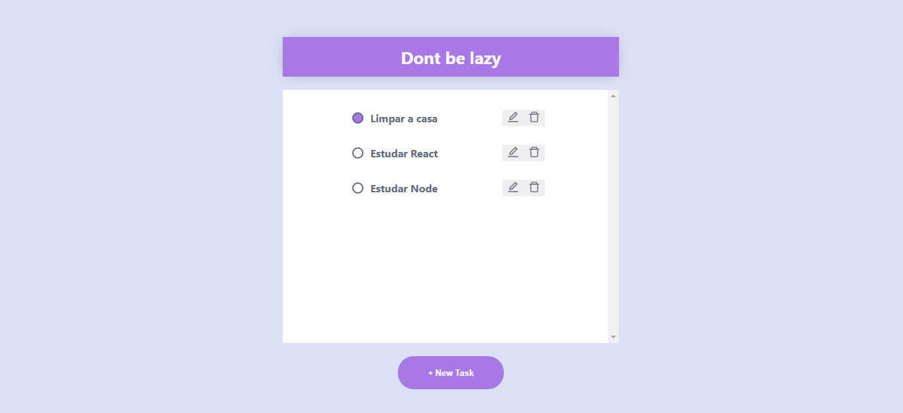

## Dont be lazy

### Layout 🚧
<div>
  
</div>
<p align="center">
    <a href="#projeto-">Projeto</a> &nbsp;&nbsp;&nbsp;|&nbsp;&nbsp;&nbsp;
    <a href="#tecnologias-">Tecnologias</a> &nbsp;&nbsp;&nbsp;|&nbsp;&nbsp;&nbsp;
    <a href="#layout-">Layout</a> &nbsp;&nbsp;&nbsp;|&nbsp;&nbsp;&nbsp;
    <a href="#licença-%EF%B8%8F">Licença</a>
</p>

##  Projeto 💻

Projeto é um To do list onde voce pode:
- criar 
- deleter 
- editar 
- marcar tarefas 

## Rodar o projeto 🚴🏻‍♂️

#### On your machine:
##### Backend
<details>
  <summary>Dependencies</summary>
  
```json
  "dependencies": {
    "nodemon": "^2.0.15",
    "@prisma/client": "^3.9.2",
    "cors": "^2.8.5",
    "express": "^4.17.2",
    "prisma": "^3.9.2"
  }
```
</details>

##### Fronted
<details>
  <summary>Dependencies</summary>

```json
  "dependencies": {
    "axios": "^0.26.0",
    "react": "^17.0.2",
    "react-dom": "^17.0.2",
    "react-icons": "^4.3.1"
  }
```
</details>

```bash
# Clone the repository
$ git clone https://github.com/GabrielMedradoS/CRUD-ToDo.git

# Access the project folder at the command prompt
$ cd CRUD-ToDo

# Install the dependencies
$ npm install

# Run the script "start"
$ npm run dev

# The project will start at the door: 3000 - access http://localhost:3000
```

## Tecnologias 🛠
Estudando o docker para ter o primeiro contato com a ferramenta
- docker Postgresql para o back end

<div>
  
  
  
  
</div>

## Licença ⚖️
This project is under the MIT license. See the archive [LICENSE]() for more details.

## Autor ✍🏾

| <a  href="https://github.com/gabrielmedrados/"><br><sub>Gabriel Medrado</sub></a>|
| :---: |
 
[](https://www.linkedin.com/in/gabriel-medrado-de-souza-9a30b3206/)
[](mailto:gabriel.medradoo@hotmail.com)
